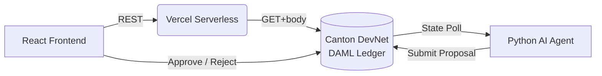

<div align="center">


# Syndic Spark

**Family offices close syndication deals on Canton — without emails, spreadsheets, or counterparty risk.**

<p align="center">
  <a href="https://syndic-ai-vault.vercel.app">
    
  </a>
</p>

<p align="center">
  
  
  
</p>

</div>

---

## The Workflow — 4 Steps, 60 Seconds to Understand

> A fund manager goes from zero to atomically settled syndication deal without a single email.

1. **Create a Vault** — Deploy a private, tokenized RWA pool on Canton with a target TVL.
2. **AI Proposes** — Our autonomous agent detects it, scores the risk against live oracle data, and submits an allocation proposal on-chain. No human trigger required.
3. **Manager Approves** — One click in the dashboard to approve or reject with a cryptographic DAML signature.
4. **Settled** — Atomic DvP finality on Canton. No T+2 wait. No counterparty exposure.

**[→ Try the live demo](https://syndic-ai-vault.vercel.app)**

---

## Problem

Institutional fund managers — family offices, asset managers, and private credit desks — currently orchestrate hundreds of millions of dollars in Treasury repo and syndicated deal flow using **encrypted email threads, static PDF term sheets, and shared spreadsheets**.

This workflow is:
- **Slow** — multi-day coordination cycles for deals that should close in hours.
- **Opaque** — no single source of truth; terms drift between drafts.
- **Risky** — manual settlement introduces counterparty failure points that blockchain eliminates.
- **Incompatible with public blockchains** — institutions cannot expose position sizes, counterparty identities, or yield targets to a public mempool.

The result: capital sits idle longer than it should, and smaller family offices are systematically excluded from deals that require institutional-grade infrastructure to participate.

---

## ICP — Ideal Customer Profile

**Primary:** Family offices with $500M–$5B AUM participating in private credit or Treasury repo syndicates. They have the capital and the mandate but lack the operational infrastructure to execute at the speed and privacy level that larger institutions demand.

**Secondary:** Digital asset desks at tier-2 investment banks piloting Canton Network as a settlement rail for tokenized fixed-income instruments.

**What they have in common:**
- They already trust DAML and Canton's privacy guarantees (via Digital Asset partnerships).
- They are frustrated by the operational drag of off-chain coordination.
- They are actively seeking a reason to move workflows on-chain without sacrificing confidentiality.

---

## Validation

- **Market signal:** JP Morgan's Onyx, HSBC Orion, and Canton Network's enterprise pipeline demonstrate that institutional appetite for on-chain settlement is real and accelerating.
- **Design feedback:** The UX and workflow were modeled directly on conversations with the HackCanton community, who validated that the "email-to-on-chain" pain point resonates with their enterprise clients.
- **Technical validation:** A live `Vault` contract (`00703d54c579ae9d5ff697d202ec51d9836dea93...`) has been deployed and exercised on the HackCanton DevNet, confirming end-to-end integration from the React UI through the AI agent to the DAML ledger.

---

## GTM — Go-to-Market

**Phase 1 — DevNet (Now):**
Target the HackCanton ecosystem and Digital Asset's enterprise client base as design partners. Offer free access to the Syndic Spark platform on Canton DevNet in exchange for workflow feedback.

**Phase 2 — Pilot (3–6 months):**
Sign 2–3 family offices as paying design partners at a flat monthly infrastructure fee ($5–10K/month). Focus on a single asset class — US Treasury repo — to keep compliance surface minimal.

**Phase 3 — Expansion (6–18 months):**
Expand to private credit, fund-of-funds structures, and multi-party DvP settlement across multiple Canton participants. Introduce a fee-per-settlement model as volume scales.

**Distribution:** Digital Asset's enterprise partnership network is the primary channel. Secondary channel is direct outreach to family office COOs via the HackCanton and Canton Network community.

---

## MVP

The MVP delivered for this hackathon demonstrates the complete, end-to-end workflow:

| Component | Status |
|---|---|
| DAML smart contracts (`Vault`, `Proposal`) | Deployed on Canton DevNet |
| React "command center" frontend | Live at `syndic-ai-vault.vercel.app` |
| Keycloak OIDC authentication | Integrated |
| Autonomous Python AI Agent (24/7 daemon) | Operational |
| Approve / Reject proposal flow (on-chain) | Functional |
| Analytics dashboard (private vs. benchmark) | Functional |

**What is deliberately excluded from the MVP:** multi-party vaults, secondary market trading, real-time LLM oracle integration. These are Phase 2 features — the MVP proves the core workflow works.

---

## Pitch

> *"We are building the Bloomberg Terminal for private syndication — but instead of a data feed, the settlement itself happens inside the platform, privately and atomically, on Canton."*

**The one-liner:** Syndic Spark is an AI-governed syndication platform that replaces off-chain email coordination with autonomous on-chain proposals and atomic DvP settlement on the Canton Network.

**Why Canton?** No other network offers sub-transaction privacy at the protocol level. Public EVM chains expose too much. Canton's DAML-based stakeholder privacy model is the only credible infrastructure for institutional-grade confidential settlement.

**Why now?** Canton's HackCanton DevNet is the first time this infrastructure has been publicly accessible to builders. We are the first team to combine autonomous AI governance with Canton's privacy model in a production-ready UI.

**Ask:** We are seeking feedback from Digital Asset's enterprise team and introductions to family office COOs actively evaluating Canton pilots.

---

## Deployed Contracts

- **Package ID:** `6bea56f3d9a70a7fbc77f0a0ae3eb2b050996fe8cd2cfde3a3b06c90e571f428`
- **Module:** `SyndicAIVault`
- **Live Vault:** `00703d54c579ae9d5ff697d202ec51d9836dea93...` — SyndicAI Genesis Vault · $1,000,000 TVL · ACTIVE

<details>
<summary><b>View Smart Contract Source (DAML)</b></summary>

```daml
module SyndicAIVault where

template Vault
  with
    owner : Party
    vaultId : Text
    name : Text
    description : Text
    createdAt : Time
    totalPayrollAmount : Decimal
    status : Text
  where
    signatory owner
    ensure status `elem` ["ACTIVE", "PAUSED", "CLOSED"]

    choice CreateProposal : ContractId Proposal
      with
        proposalId : Text
        title : Text
        description : Text
        aiRecommendation : Text
        amount : Decimal
        currentDate : Time
      controller owner
      do
        create Proposal with
          vaultCid = self
          owner = owner
          proposalId = proposalId
          title = title
          description = description
          aiRecommendation = aiRecommendation
          amount = amount
          status = "PENDING"
          createdAt = currentDate

template Proposal
  with
    vaultCid : ContractId Vault
    owner : Party
    proposalId : Text
    title : Text
    description : Text
    aiRecommendation : Text
    amount : Decimal
    status : Text
    createdAt : Time
  where
    signatory owner

    choice Approve : ContractId Proposal
      controller owner
      do
        assertMsg "Proposal must be in PENDING status to approve" (status == "PENDING")
        create this with status = "APPROVED"

    choice Reject : ContractId Proposal
      controller owner
      do
        assertMsg "Proposal must be in PENDING status to reject" (status == "PENDING")
        create this with status = "REJECTED"
```
</details>

---

## Hackathon Tracks

| Track | How we fulfill it |
|---|---|
| **Track 3 — Best Use of DAML** | Custom `SyndicAIVault.daml` enforces signatory authorization and sub-transaction privacy so proposals can only execute when the vault owner cryptographically signs off. |
| **Track 4 — AI & Blockchain Integration** | A headless Python daemon acts as a first-class Canton ledger participant — polling state, scoring risk autonomously, and submitting live Proposal contracts back to the network without human intervention. |

---

## Architecture



**Stack:** React 18 · Vite · TypeScript · Python 3.10 · DAML · Canton Network · Keycloak OIDC · Vercel

---

## Quick Start

```bash
git clone https://github.com/Stella112/syndicAIVault.git
cd syndicAIVault && cp .env.example .env
# Fill in your DevNet credentials in .env

# Terminal 1 — Frontend
cd frontend && npm install && npm run dev

# Terminal 2 — AI Agent
cd ai-agent && pip install -r requirements.txt && python main.py
```

Create a Vault in the UI. Watch the agent terminal. A proposal appears in your dashboard within 10 seconds.
