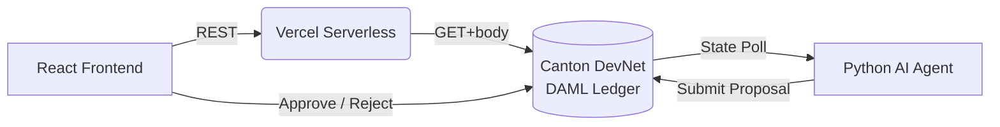

<div align="center">


# Syndic Spark

**Family offices close syndication deals on Canton — without emails, spreadsheets, or counterparty risk.**

<p align="center">
  <a href="https://syndic-ai-vault.vercel.app">
    
  </a>
</p>

<p align="center">
  
  
  
</p>

</div>

---

## The workflow — in 4 steps

> **A fund manager can go from zero to atomically settled syndication deal in under a minute.**

1. **Create a Vault** — Deploy a private, tokenized RWA pool on Canton with a target TVL.
2. **AI Proposes** — Our autonomous agent detects the vault, scores it against live oracle data, and submits an allocation proposal directly on-chain. No human trigger required.
3. **Manager Approves** — The proposal appears in the dashboard. One click to approve or reject with a cryptographic DAML signature.
4. **Settled** — Atomic DvP settlement across Canton. No emails. No spreadsheets. No counterparty risk.

**[→ Try it now on the live demo](https://syndic-ai-vault.vercel.app)**

---

## The Problem

Today, institutional fund managers coordinate hundreds of millions in Treasury repo and private credit deals over **encrypted emails and static PDF term sheets**. The process is manual, slow, and completely opaque. Coordinating it on a public blockchain is not an option — they cannot afford to expose position sizes or counterparty terms to the market.

They need the certainty of on-chain settlement without sacrificing privacy.

---

## What We Built

Syndic Spark is a Canton-native "command center" that replaces the entire off-chain coordination workflow:

- **Sub-Transaction Privacy** — Position sizes and terms are visible only to involved parties. Canton's DAML privacy model handles this at the protocol level.
- **Autonomous AI Agent** — A Python daemon continuously polls the ledger, evaluates risk, and submits proposals automatically. No manual analysis required.
- **Atomic Settlement** — Once approved, deals settle instantly and irreversibly. T+2 becomes T+0.

---

## Deployed on Canton DevNet

- **Package ID:** `6bea56f3d9a70a7fbc77f0a0ae3eb2b050996fe8cd2cfde3a3b06c90e571f428`
- **Module:** `SyndicAIVault`
- **Live Vault Contract:** `00703d54c579ae9d5ff697d202ec51d9836dea93...` (SyndicAI Genesis Vault · $1,000,000 TVL · ACTIVE)

<details>
<summary><b>View Smart Contract Source (DAML)</b></summary>

```daml
module SyndicAIVault where

template Vault
  with
    owner : Party
    vaultId : Text
    name : Text
    description : Text
    createdAt : Time
    totalPayrollAmount : Decimal
    status : Text
  where
    signatory owner
    ensure status `elem` ["ACTIVE", "PAUSED", "CLOSED"]

    choice CreateProposal : ContractId Proposal
      with
        proposalId : Text
        title : Text
        description : Text
        aiRecommendation : Text
        amount : Decimal
        currentDate : Time
      controller owner
      do
        create Proposal with
          vaultCid = self
          owner = owner
          proposalId = proposalId
          title = title
          description = description
          aiRecommendation = aiRecommendation
          amount = amount
          status = "PENDING"
          createdAt = currentDate

template Proposal
  with
    vaultCid : ContractId Vault
    owner : Party
    proposalId : Text
    title : Text
    description : Text
    aiRecommendation : Text
    amount : Decimal
    status : Text
    createdAt : Time
  where
    signatory owner

    choice Approve : ContractId Proposal
      controller owner
      do
        assertMsg "Proposal must be in PENDING status to approve" (status == "PENDING")
        create this with status = "APPROVED"

    choice Reject : ContractId Proposal
      controller owner
      do
        assertMsg "Proposal must be in PENDING status to reject" (status == "PENDING")
        create this with status = "REJECTED"
```
</details>

---

## Hackathon Tracks

| Track | How we fulfill it |
|---|---|
| **Track 3 — Best Use of DAML** | Custom `SyndicAIVault.daml` enforces signatory authorization and sub-transaction privacy so proposals can only execute when the vault owner cryptographically signs off. |
| **Track 4 — AI & Blockchain Integration** | A headless Python daemon acts as a first-class Canton ledger participant — polling state, scoring risk autonomously, and submitting live Proposal contracts back to the network. |

---

## Architecture



**Stack:** React 18 · Vite · TypeScript · Python 3.10 · DAML · Canton Network · Keycloak OIDC

---

## Quick Start

```bash
git clone https://github.com/Stella112/syndicAIVault.git
cd syndicAIVault && cp .env.example .env
# Add your DevNet credentials to .env

# Terminal 1 — Frontend
cd frontend && npm install && npm run dev

# Terminal 2 — AI Agent
cd ai-agent && pip install -r requirements.txt && python main.py
```

Create a Vault in the UI, watch the agent terminal — a proposal appears in your dashboard within 10 seconds.
