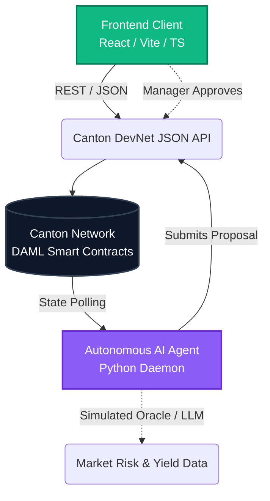

<div align="center">

<!-- You can replace this with a dedicated banner image later if you have one -->


# Syndic Spark

**Privacy-first RWA syndication, governed by AI on the Canton Network.**

<p align="center">
  
  
  
</p>

</div>

---

## The Problem: Syndication is Stuck in the Dark Ages

Today, institutional fund managers orchestrate hundreds of millions of dollars in syndicated private credit and Treasury repo flows using **encrypted emails, fragmented spreadsheets, and static PDF term sheets**. 

This archaic workflow is incredibly slow, highly error-prone, and relies entirely on manual counterparty trust. Worse, coordinating these deals on public blockchains exposes sensitive competitive alpha and trade sizes to the entire market. Institutions need the mathematical certainty of blockchain settlement, but they refuse to sacrifice sub-transaction privacy.

## The Solution: Syndic Spark

Syndic Spark is an institutional-grade "command center" built natively on the Canton Network. It replaces manual coordination with autonomous, deterministic, and entirely private on-ledger operations.

- **Sub-Transaction Privacy:** Users deploy capital and negotiate terms with absolute privacy. Your position sizes, terms, and counterparties remain hidden from the broader network, selectively disclosed *only* to necessary participants.
- **Autonomous AI Governance:** Remove the manual bottlenecks of risk assessment. Our autonomous on-ledger Python daemon continuously evaluates vault risk profiles against live oracle data and automatically proposes mathematically sound allocations.
- **Atomic DvP Settlement:** Bypass legacy T+2 clearing. Once an AI proposal is cryptographically signed by the vault managers, the syndication settles atomically across the Canton Network, reducing counterparty risk to zero.

---

## Architecture & Tech Stack



### Deployed Contracts (HackCanton DevNet)
- **Package ID:** `6bea56f3d9a70a7fbc77f0a0ae3eb2b050996fe8cd2cfde3a3b06c90e571f428`
- **Module:** `SyndicAIVault`
- **Templates:**
  - `Vault`: Represents the tokenized Real World Asset (RWA) pool and TVL constraints.
  - `Proposal`: Represents an active AI-generated allocation proposal requiring manager cryptographic signature for execution.

### The Stack
- **Smart Contracts:** DAML (Digital Asset Modeling Language)
- **Network:** Canton Network (HackCanton DevNet)
- **Frontend:** React 18, Vite, TypeScript, Tailwind-inspired custom OKLCH CSS
- **AI Agent:** Python 3.10, `requests` daemon
- **Auth:** Keycloak OIDC Resource-Owner Password Grant

---

## Hackathon Tracks Targeted

We built Syndic Spark to specifically target two major bounties:

1. **Track 3: Best Use of DAML**
   *How we fulfill it:* We authored a custom `SyndicAIVault.daml` contract suite that leverages DAML's strict authorization and privacy model to ensure syndication proposals can only be executed when all required stakeholders cryptographically sign off.
2. **Track 4: AI & Blockchain Integration**
   *How we fulfill it:* We built a headless Python daemon that acts as a first-class citizen on the Canton ledger. It autonomously monitors state, runs risk-scoring algorithms (simulating an LLM/Oracle pipeline), and submits live Proposal contracts back to the network.

---

## Quick Start (Frictionless Testing)

Want to see the platform operate on your local machine?

### 1. Clone & Configure
```bash
git clone https://github.com/Stella112/syndicAIVault.git
cd syndicAIVault
cp .env.example .env
```
*(Open `.env` and paste your DevNet email, password, and Party ID).*

### 2. Start the Command Center (Frontend)
```bash
cd frontend
npm install
npm run dev
```
Open `http://localhost:3000` to view the UI.

### 3. Unleash the AI Agent
In a new terminal window:
```bash
cd ai-agent
python -m venv venv
# Windows: .\venv\Scripts\activate | Mac/Linux: source venv/bin/activate
pip install -r requirements.txt
python main.py
```
**To Test:** Log into the frontend, create a new "Active LP Interest" Vault, and watch the Python agent terminal. Within 10 seconds, it will detect the vault, evaluate the risk, and push a live proposal back to your dashboard for approval.
